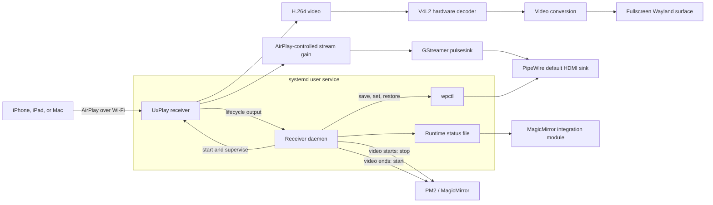

# MMM-Airplay-Receiver

`MMM-Airplay-Receiver` adds AirPlay screen mirroring to a MagicMirror display
on Raspberry Pi. An iPhone, iPad, or Mac can select the mirror from Apple's
standard Screen Mirroring menu and use the complete display. MagicMirror is
temporarily stopped during the session and returns automatically when sharing
ends.

The solution combines:

- [UxPlay](https://github.com/FDH2/UxPlay) as the AirPlay receiver
- GStreamer for hardware-accelerated audio and video rendering
- A systemd user service for receiver availability and supervision
- PM2 for the MagicMirror display handoff
- PipeWire/WirePlumber for Raspberry Pi audio output
- A MagicMirror module for status integration and notifications

The checked-in configuration targets the `Art Wall` Raspberry Pi installation
and supports iPhone, iPad, and Mac clients over Wi-Fi.

## Design principles

### Receiver availability is independent of MagicMirror

UxPlay runs under an external systemd user service rather than as a child of
MagicMirror. The AirPlay receiver therefore remains advertised while
MagicMirror is running and remains alive when MagicMirror releases the display.

### Mirrored media bypasses the MagicMirror browser

AirPlay audio and video are rendered directly through GStreamer. Video is not
decoded in Electron or passed through the MagicMirror DOM. This provides access
to the Raspberry Pi's hardware H.264 decoder and native Wayland fullscreen
surface.

### Display ownership follows the video lifecycle

The receiver daemon interprets UxPlay lifecycle events and coordinates PM2.
MagicMirror stops only while a video-mirroring stream is active. Audio-only
AirPlay leaves MagicMirror visible and changes only the audio path.

### One low-latency profile serves all supported clients

The receiver requests 1920×1080 at 60 Hz and presents frames without building a
timestamp-synchronized playback queue. The same settings are used for iPhone,
iPad, and Mac screen mirroring.

### System audio changes are temporary

The daemon saves the existing PipeWire volume and mute state before changing
them for AirPlay. During either audio-only streaming or video mirroring, the
Raspberry Pi output is unmuted and capped at 100%, while the Apple device
controls the AirPlay stream gain. The saved Pi state is restored after the last
active AirPlay media stream ends.

### The integration remains visually silent

The MagicMirror module monitors receiver state and publishes notifications, but
its on-screen status tile is disabled. PIN pairing is also disabled unless a
client requires it for compatibility.

## Solution architecture



## Component responsibilities

| Component | Responsibility |
| --- | --- |
| `systemd/mmm-airplay-receiver.service` | Starts and supervises the receiver independently from MagicMirror |
| `receiver_daemon.js` | Owns UxPlay and serializes display and volume handoffs |
| `receiver-daemon.config.json` | Defines the deployed AirPlay, rendering, audio, volume, and PM2 profile |
| `lib/uxplay.js` | Validates receiver settings and builds the UxPlay command and graphical-session environment |
| `lib/daemon-events.js` | Classifies UxPlay audio/video events and tracks both stream types independently |
| `lib/system-volume.js` | Captures, caps, unmutes, and restores the PipeWire default-sink volume |
| `MMM-Airplay-Receiver.js` | Provides MagicMirror-side state, optional UI, and module notifications |
| `node_helper.js` | Polls the external status file and forwards state into MagicMirror |
| UxPlay | Implements AirPlay discovery, connection handling, and media reception |
| GStreamer | Decodes, converts, and renders the audio/video streams |
| Avahi | Advertises the receiver over mDNS |
| PM2 | Runs MagicMirror and accepts the daemon's stop/start requests |
| PipeWire/WirePlumber | Routes audio to the Raspberry Pi's selected HDMI output |

## Operating sequence

The daemon maintains independent `audioActive` and `videoActive` state. It
derives the two handoffs from those flags:

| Audio | Video | Receiver state | Pi volume | MagicMirror |
| --- | --- | --- | --- | --- |
| Inactive | Inactive | `READY` | Restored value | Running |
| Active | Inactive | `STREAMING` (audio) | Temporary ceiling | Running |
| Inactive | Active | `STREAMING` (mirroring) | Temporary ceiling | Stopped |
| Active | Active | `STREAMING` (mirroring) | Temporary ceiling | Stopped |

The volume handoff is active while either media stream is active. The display
handoff is active only while video is active. This prevents audio-only playback
from blanking the mirror and prevents either stream stopping early from
restoring shared state while the other stream remains active.

### Service startup

1. The systemd user service starts `receiver_daemon.js` after the graphical
   session and network are available.
2. The daemon loads `receiver-daemon.config.json`.
3. It builds the UxPlay environment, including the Wayland runtime directory,
   Wayland socket, and D-Bus session address.
4. The daemon starts UxPlay with line-buffered output.
5. UxPlay advertises `Art Wall` through Avahi and reports that its server socket
   is initialized.
6. The daemon writes a `READY` status record. MagicMirror continues running.

### Audio-only streaming

1. An Apple device selects `Art Wall` as an AirPlay audio destination.
2. UxPlay emits `raop_rtp starting audio`.
3. The stream tracker marks audio active and writes `STREAMING` with an
   audio-specific status message.
4. The volume manager reads and stores the PipeWire default-sink volume and
   mute state, sets a 100% ceiling, and unmutes the sink.
5. MagicMirror continues running because no video stream is active.
6. UxPlay maps volume-button events onto the GStreamer stream gain.
7. When UxPlay emits `raop_rtp exiting thread`, the daemon restores the saved Pi
   volume and mute state.

### Screen mirroring start

1. An Apple device selects `Art Wall` and establishes an AirPlay session.
2. UxPlay may start its audio stream before or after its video stream. The
   daemon tracks both events without treating either as the complete session.
3. `raop_rtp_mirror starting mirroring` marks video active and changes the
   status message to screen mirroring.
4. The volume handoff starts when the first audio or video stream becomes
   active. A second start event does not overwrite the saved Pi volume.
5. The video event causes PM2 to stop `MagicMirror`.
6. UxPlay renders video in a native fullscreen Wayland surface and sends any
   mirrored audio to the PipeWire-backed PulseAudio sink.

### Active mirroring

The Apple device controls the AirPlay stream volume. UxPlay maps those volume
events onto the GStreamer audio stream using the configured tapered gain curve.
The Raspberry Pi master output remains at its temporary 100% ceiling while any
AirPlay audio or video stream remains active.

Video is decoded and presented independently of MagicMirror. The receiver
daemon stays active, monitors UxPlay, records selected format and performance
messages, and waits for the disconnect event.

### Screen mirroring end

1. UxPlay reports video shutdown through its mirror reset or thread-exit
   lifecycle messages.
2. The tracker marks video inactive and PM2 starts MagicMirror.
3. If an audio stream is still active, the receiver remains `STREAMING` and the
   100% volume ceiling remains in effect.
4. When the audio thread also exits, the tracker becomes fully inactive, the
   daemon writes `READY`, and the saved PipeWire volume and mute state are
   restored.
5. If audio stops before video, the volume ceiling remains active until video
   also stops and MagicMirror remains stopped until the video event ends.
6. UxPlay remains active and advertised for the next client.

### Receiver or service shutdown

If UxPlay exits unexpectedly, the daemon restores the saved audio state, starts
MagicMirror, and schedules a receiver restart after the configured delay.
Normal `SIGINT`, `SIGTERM`, and uncaught-error shutdown paths also request
volume restoration and MagicMirror startup. The systemd unit includes an
`ExecStopPost` fallback that starts MagicMirror when the service stops.

Duplicate lifecycle messages are idempotent. Repeated audio or video start
events cannot replace the saved pre-session volume with the temporary 100%
value, and repeated stop events do not repeat restoration or PM2 operations.

Like any in-memory cleanup mechanism, restoration cannot run after an immediate
power loss or `SIGKILL`.

## Video pipeline

The deployed video profile is defined in `receiver-daemon.config.json`:

| Setting | Value | Purpose |
| --- | --- | --- |
| Requested resolution | `1920x1080@60` | Requests Full HD output and a 60 Hz client stream |
| Maximum frame rate | `60` | Supports smooth video and desktop movement |
| Decoder | `v4l2h264dec` | Uses Raspberry Pi H.264 hardware decoding |
| Decoder I/O | `capture-io-mode=mmap output-io-mode=mmap` | Uses explicit V4L2 memory-mapped buffers |
| Converter | `videoconvert` | Converts decoded frames for the selected Wayland sink |
| Color handling | `-bt709 -srgb no` | Selects the color path used by the Raspberry Pi display pipeline |
| UxPlay fullscreen | `false` | Leaves generic `-fs` disabled |
| Video sink | Native fullscreen `waylandsink` | Owns the complete Wayland output while mirroring |
| Freeze behavior | `-nofreeze` | Closes the video surface when mirroring ends |
| Timing | `-vsync no`, `sync=false`, `async=false` | Presents frames immediately instead of queueing for timestamp playback |

The generated decoder and converter arguments are:

```text
-vd "v4l2h264dec capture-io-mode=mmap output-io-mode=mmap"
-vc videoconvert
```

The complete video sink is:

```text
waylandsink fullscreen=true sync=false async=false enable-last-sample=false processing-deadline=0
```

Fullscreen is deliberately owned by `waylandsink fullscreen=true`. The daemon's
`fullscreen: false` setting only disables UxPlay's generic `-fs` option; it does
not make the resulting video window non-fullscreen.

## Audio and volume pipeline

### Audio rendering

UxPlay passes both audio-only AirPlay and mirrored audio through GStreamer to:

```text
pulsesink sync=false async=false buffer-time=20000 latency-time=10000 processing-deadline=0
```

On the Raspberry Pi, the PulseAudio protocol is provided by PipeWire. The sink
therefore routes to the WirePlumber-selected default output, currently the HDMI
stereo device.

The sink uses a 20 ms buffer and 10 ms latency target. Timestamp synchronization
is disabled to match the immediate video presentation strategy.

### Apple device volume

UxPlay receives AirPlay volume changes generated by the connected device. The
profile adds:

```text
-db -50:0 -taper
```

`-db -50:0` maps the AirPlay control range onto a stream-gain range from mute or
heavy attenuation through 0 dB. `-taper` applies a perceptual taper so the
volume buttons provide useful control across the range instead of clustering
most of the audible change near maximum volume.

This changes the GStreamer stream gain; it does not repeatedly move the
PipeWire master-volume slider.

### Raspberry Pi volume ceiling

The effective output during any active AirPlay media session has two stages:

```text
audible output = temporary Pi system ceiling × AirPlay stream gain
```

The daemon uses `wpctl` to make the full Pi output range available while the
Apple device controls an audio-only or mirrored stream:

1. Run `wpctl get-volume @DEFAULT_AUDIO_SINK@`.
2. Parse and save both the scalar volume and `[MUTED]` state.
3. Set the default sink to the configured limit with `wpctl set-volume -l`.
4. Unmute the default sink with `wpctl set-mute ... 0`.
5. After the last active audio or video stream ends, restore the saved scalar
   volume.
6. Restore the saved mute state.

For the checked-in configuration, an idle Pi volume of 40% transitions as
follows:

```text
before AirPlay: 40%
during AirPlay: 100% system ceiling × Apple-controlled stream gain
after AirPlay:  40%
```

The volume manager logs command or parsing errors and allows mirroring to
continue. It changes the system volume only after successfully reading the
current value, so it always has a restoration value before applying the
temporary ceiling.

### Volume configuration

```json
{
  "manageSystemVolume": true,
  "systemVolumeLimitPercent": 100,
  "systemVolumeTarget": "@DEFAULT_AUDIO_SINK@",
  "wpctlPath": "/usr/bin/wpctl"
}
```

| Option | Meaning |
| --- | --- |
| `manageSystemVolume` | Enables capture, temporary adjustment, and restoration |
| `systemVolumeLimitPercent` | Temporary sink level and command ceiling; accepts 1 through 100 |
| `systemVolumeTarget` | WirePlumber object passed to `wpctl`; defaults to the current default audio sink |
| `wpctlPath` | Absolute path to the WirePlumber control command |

Set `manageSystemVolume` to `false` to leave the Pi master volume unchanged and
use only UxPlay's AirPlay stream gain.

## MagicMirror integration

The MagicMirror module operates in external-service mode. It does not start or
stop UxPlay. Its node helper reads the daemon's atomically-written status file
once per second and forwards changes to the browser-side module.

The status file is:

```text
/run/user/1000/mmm-airplay-receiver-status.json
```

It contains the state, message, receiver name, and update timestamp. States are
`STARTING`, `READY`, `STREAMING`, `ERROR`, or `STOPPED`.

The module publishes:

- `AIRPLAY_RECEIVER_STATUS`
- `AIRPLAY_RECEIVER_PIN`

`showStatus: false` keeps the module DOM hidden. The integration and
notifications remain active while MagicMirror is running.

The repository also retains an optional in-process mode with
`externalService: false`. In that mode, `node_helper.js` owns UxPlay and accepts
`AIRPLAY_RECEIVER_START`, `AIRPLAY_RECEIVER_STOP`, and
`AIRPLAY_RECEIVER_RESTART`. In-process mode cannot provide the same independent
MagicMirror handoff and is not used by the Art Wall deployment.

## Pairing and network access

PIN pairing is disabled in `receiver-daemon.config.json`. Normal clients can
connect without entering a code. Set `pin` to `true` for a generated PIN or to
a four-digit string such as `"4821"` for a fixed PIN. Client registration is
relevant only when PIN pairing is enabled.

The Raspberry Pi and Apple device must be on the same local network. The network
must allow:

- Multicast UDP 5353 for Avahi/mDNS discovery
- TCP and UDP 7000–7002 for the configured UxPlay session ports

The deployed Pi has a Wi-Fi-only connection. A stable 5 GHz connection to the
same access point is recommended for 1080p60 mirroring.

## Platform requirements

The deployed profile uses:

- Raspberry Pi 4 with Raspberry Pi OS Bookworm
- Native Wayland/labwc graphical session
- MagicMirror managed by PM2 as `MagicMirror`
- Node.js 18 or newer
- UxPlay 1.73.6
- GStreamer with `v4l2h264dec`, `videoconvert`, `waylandsink`, and `pulsesink`
- PipeWire/WirePlumber with `wpctl`
- Avahi for mDNS advertisement
- Node.js and PM2 under `/usr/local/bin`

Other users, command locations, compositor sockets, output devices, or process
names require corresponding configuration changes.

## Installation and deployment

### Deploy the module and UxPlay

Configure SSH key authentication, then run from the development machine:

```bash
./scripts/deploy.sh --install-uxplay streicher@artwall1.local
```

`--install-uxplay` installs the Debian build and GStreamer dependencies, builds
the pinned UxPlay 1.73.6 release, installs it under `/usr/local`, and enables
Avahi. Omit the option on subsequent deployments.

The deployment script copies only this module. It does not read or replace
MagicMirror's `config.js`.

### Configure MagicMirror

Add the following object to the `modules` array in
`~/MagicMirror/config/config.js`:

```js
{
  module: "MMM-Airplay-Receiver",
  position: "top_center",
  config: {
    receiverName: "Art Wall",
    externalService: true,
    externalStatusFile: "/run/user/1000/mmm-airplay-receiver-status.json",
    showStatus: false
  }
},
```

The receiver name should match `receiver-daemon.config.json`. The runtime path
assumes that the graphical user's numeric ID is `1000`; verify it with `id -u`.

The included helpers preserve timestamped backups when adding or changing the
module entry:

```bash
node scripts/enable-module.mjs ~/MagicMirror/config/config.js "Art Wall" waylandsink

node scripts/update-module-config.mjs ~/MagicMirror/config/config.js \
  '{"externalService":true,"externalStatusFile":"/run/user/1000/mmm-airplay-receiver-status.json","showStatus":false}'
```

### Install the external service

Verify the configured executable paths on the Pi:

```bash
command -v node
command -v pm2
command -v wpctl
```

Install and start the user service:

```bash
cd ~/MagicMirror/modules/MMM-Airplay-Receiver
./scripts/install-service.sh
pm2 restart MagicMirror
```

### Deploy an update

```bash
./scripts/deploy.sh streicher@artwall1.local
ssh streicher@artwall1.local \
  systemctl --user restart mmm-airplay-receiver.service
```

The service must be restarted after deployment so the daemon loads the new code
and configuration.

## Operations and diagnostics

Check receiver and MagicMirror state:

```bash
systemctl --user status mmm-airplay-receiver.service
pm2 status
```

Follow receiver lifecycle, rendering, and volume messages:

```bash
journalctl --user -u mmm-airplay-receiver.service -f
```

Read the latest integration state:

```bash
cat /run/user/1000/mmm-airplay-receiver-status.json
```

Inspect the audio graph and current default-sink volume:

```bash
wpctl status
wpctl get-volume @DEFAULT_AUDIO_SINK@
```

Check AirPlay discovery and hardware decoding:

```bash
systemctl status avahi-daemon
gst-inspect-1.0 v4l2h264dec
```

Restart the receiver:

```bash
systemctl --user restart mmm-airplay-receiver.service
```

The deployed graphical-session values are:

```text
XDG_RUNTIME_DIR=/run/user/1000
WAYLAND_DISPLAY=wayland-0
DBUS_SESSION_BUS_ADDRESS=unix:path=/run/user/1000/bus
```

Adjust these values if the graphical user ID or Wayland socket changes.

## Development

Run the automated tests and JavaScript syntax checks before deployment:

```bash
npm test
npm run check
```

The tests cover UxPlay argument generation, graphical-session discovery,
lifecycle parsing, independent audio/video state, pairing, hardware-accelerated
fullscreen rendering, volume configuration, duplicate session events,
mute-state handling, and exact volume restoration.
