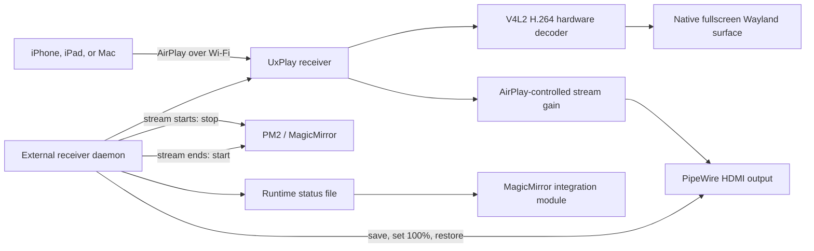

# MMM-Airplay-Receiver

`MMM-Airplay-Receiver` adds AirPlay screen mirroring to a MagicMirror display
on Raspberry Pi. An iPhone, iPad, or Mac can select the mirror from the normal
Screen Mirroring menu and take over the display for the duration of the
session. When sharing stops, MagicMirror returns automatically.

The module uses [UxPlay](https://github.com/FDH2/UxPlay) as the AirPlay
receiver and GStreamer as the hardware-accelerated video pipeline.

## What are we building?

Let us describe the design as if we were explaining it to a rubber duck.

The mirror has two jobs:

1. Show MagicMirror during normal operation.
2. Show an AirPlay stream fullscreen when an Apple device connects.

AirPlay discovery must remain available while MagicMirror is running, and the
receiver must keep running when MagicMirror gives up the display. The video
should go directly to the Raspberry Pi's native graphics stack rather than
through MagicMirror's browser window.

Those requirements lead to three separate responsibilities:

- A background service owns the AirPlay receiver.
- A receiver daemon coordinates the screen handoff.
- A MagicMirror module observes the receiver and publishes integration events.

## Solution architecture



## Rubber-duck walkthrough

### Who keeps AirPlay available?

The `mmm-airplay-receiver.service` user service starts
`receiver_daemon.js`. The daemon starts UxPlay and keeps it running
independently from MagicMirror.

UxPlay advertises the configured receiver name with Avahi/mDNS. This is why
the mirror appears in the Screen Mirroring list even though the MagicMirror UI
does not display an AirPlay status message.

### Who decides what owns the screen?

The daemon reads UxPlay's lifecycle output.

- When UxPlay is ready, MagicMirror is allowed to run.
- When mirroring starts, the daemon asks PM2 to stop `MagicMirror`.
- When mirroring ends, the daemon asks PM2 to start `MagicMirror`.
- When the service stops, its systemd cleanup also starts MagicMirror.

The daemon remains alive throughout the handoff, so the AirPlay connection and
the process controlling MagicMirror do not depend on one another.

### How does video reach the display?

UxPlay receives the AirPlay H.264 stream and passes it to GStreamer. The
pipeline uses the Raspberry Pi's V4L2 H.264 decoder, converts the decoded
frames into a displayable format, and sends them to a native Wayland sink.

The Wayland sink owns a fullscreen surface. It is not embedded in MagicMirror
and it does not rely on the Raspberry Pi desktop window layout. This gives the
stream the whole display, including the area normally occupied by desktop
panels or MagicMirror.

### How do the Apple device's volume buttons work?

UxPlay receives the AirPlay volume selected by the connected device and maps it
onto the GStreamer audio stream with a tapered gain curve. The phone or tablet
therefore controls the audible mirroring volume.

At the start of a session, the daemon reads and saves the current PipeWire
default-sink volume and mute state. It sets that sink to an unmuted 100% ceiling
while UxPlay applies the client-controlled stream gain. At the end of the
session, the daemon restores the saved Pi volume and mute state. Duplicate
stream events do not overwrite the saved state.

### What does the MagicMirror module do?

In external-service mode, the module does not launch UxPlay. Its node helper
polls the daemon's JSON status file once per second and forwards lifecycle
changes to MagicMirror as notifications.

The visible module tile is disabled with `showStatus: false`. The module still
provides integration state for any other MagicMirror module that wants to
react to AirPlay activity.

### What happens during one session?

1. systemd starts the receiver daemon with the graphical-session environment.
2. The daemon starts UxPlay.
3. UxPlay advertises `Art Wall` on the local network.
4. A user selects `Art Wall` from Screen Mirroring.
5. UxPlay establishes the stream and creates the fullscreen Wayland surface.
6. The daemon marks the state as `STREAMING`, saves the Pi volume, sets the HDMI
   sink to 100%, and stops MagicMirror through PM2.
7. GStreamer decodes and renders the stream; the Apple device controls its
   audio gain.
8. When the client disconnects, the daemon restores the Pi volume and mute
   state.
9. The daemon marks the state as `READY` and starts MagicMirror again.
10. UxPlay remains advertised for the next session.

## Component responsibilities

| Component | Responsibility |
| --- | --- |
| `systemd/mmm-airplay-receiver.service` | Starts, supervises, and restarts the external receiver daemon |
| `receiver_daemon.js` | Owns UxPlay, interprets stream events, writes status, and coordinates MagicMirror and volume handoffs |
| `receiver-daemon.config.json` | Defines the receiver, display, audio, volume, performance, and PM2 profile |
| `lib/uxplay.js` | Validates configuration and builds the UxPlay command and environment |
| `lib/daemon-events.js` | Converts UxPlay output into `READY` and `STREAMING` lifecycle events |
| `lib/system-volume.js` | Saves, caps, unmutes, and restores the PipeWire default-sink volume |
| `MMM-Airplay-Receiver.js` | Provides the MagicMirror-side integration and notifications |
| `node_helper.js` | Monitors external status or, in optional in-process mode, owns UxPlay directly |
| UxPlay | Implements the AirPlay receiver and creates the GStreamer pipeline |
| GStreamer | Decodes, converts, and renders the audio/video stream |
| Avahi | Publishes the receiver over mDNS |
| PM2 | Runs MagicMirror and accepts the daemon's stop/start handoff |

## Reference rendering profile

The included `receiver-daemon.config.json` defines the Art Wall profile:

| Setting | Value | Design intent |
| --- | --- | --- |
| Receiver name | `Art Wall` | Friendly name in Apple's Screen Mirroring menu |
| Resolution | `1920x1080@60` | Full-HD output with a 60 Hz stream target |
| Advertised frame rate | `60` | Smooth video and desktop motion |
| Video decoder | `v4l2h264dec` | Raspberry Pi H.264 hardware decoding |
| Decoder I/O | `mmap` capture and output | Explicit V4L2 buffer allocation |
| Video conversion | `videoconvert` | Converts decoded frames for the Wayland sink |
| Video sink | `waylandsink` | Native rendering in the active Wayland session |
| Fullscreen owner | `waylandsink fullscreen=true` | Gives the stream the complete display |
| Video timing | `-vsync no`, `sync=false`, `async=false` | Presents received frames without adding a playback queue |
| Audio sink | Low-buffer `pulsesink` | Sends audio to the graphical session with minimal buffering |
| AirPlay volume curve | `-db -50:0 -taper` | Maps device volume buttons onto a useful tapered stream-gain range |
| Pi volume ceiling | `100%` | Makes the full HDMI output range available during mirroring |
| Volume restoration | Enabled | Returns the previous Pi volume and mute state after mirroring |
| Pairing | `pin: false` | Allows normal clients without mandatory PIN entry |
| MagicMirror handoff | `manageMagicMirror: true` | Stops and starts the configured PM2 process automatically |

The complete video sink string is:

```text
waylandsink fullscreen=true sync=false async=false enable-last-sample=false processing-deadline=0
```

The decoder and converter arguments are:

```text
-vd "v4l2h264dec capture-io-mode=mmap output-io-mode=mmap"
-vc videoconvert
```

`fullscreen` is set to `false` in the daemon configuration because that option
controls UxPlay's generic `-fs` flag. Fullscreen ownership belongs to the native
Wayland sink in this architecture.

The same immediate-rendering profile is used for iPhone, iPad, and Mac clients.
It prioritizes screen-response latency and cross-device behavior over building
a larger timestamp-synchronized playback buffer.

The system-volume handoff is configured with:

```json
{
  "manageSystemVolume": true,
  "systemVolumeLimitPercent": 100,
  "systemVolumeTarget": "@DEFAULT_AUDIO_SINK@",
  "wpctlPath": "/usr/bin/wpctl"
}
```

`systemVolumeLimitPercent` accepts values from 1 through 100. The configured
limit is passed to `wpctl` as both the requested volume and the command ceiling.

## Platform and network

The reference installation uses:

- Raspberry Pi 4 with Raspberry Pi OS Bookworm
- Native Wayland/labwc graphical session
- MagicMirror managed by PM2 as `MagicMirror`
- Node.js and PM2 under `/usr/local/bin`
- UxPlay 1.73.6
- Wi-Fi network connection

The Pi and AirPlay client must be on the same local network, with multicast
traffic allowed between them. A stable 5 GHz Wi-Fi connection is recommended
for 1080p60 mirroring.

## Install and deploy

### Requirements

- MagicMirror²
- Node.js 18 or newer
- PM2 managing MagicMirror
- PipeWire/WirePlumber with `wpctl`
- A Debian-based Raspberry Pi installation with a graphical session
- SSH key authentication for remote deployment

### Copy the module and install UxPlay

From the development machine:

```bash
./scripts/deploy.sh --install-uxplay streicher@artwall1.local
```

The `--install-uxplay` option installs build dependencies, builds the pinned
UxPlay 1.73.6 release, installs the required GStreamer plugins, and enables
Avahi. Omit it on later deployments.

The deploy script copies only this module. It does not read or replace
MagicMirror's `config.js`.

### Configure the MagicMirror integration

Add this entry to the `modules` array in
`~/MagicMirror/config/config.js` on the Pi:

```js
{
  module: "MMM-Airplay-Receiver",
  position: "top_center",
  config: {
    receiverName: "Art Wall",
    externalService: true,
    externalStatusFile: "/run/user/1000/mmm-airplay-receiver-status.json",
    showStatus: false
  }
},
```

The receiver name should match the name in `receiver-daemon.config.json`.
The `/run/user/1000` path assumes that the graphical user ID is `1000`; use
`id -u` on the Pi to check it.

The included helpers can add or update the module entry while retaining a
timestamped backup:

```bash
node scripts/enable-module.mjs ~/MagicMirror/config/config.js "Art Wall" waylandsink

node scripts/update-module-config.mjs ~/MagicMirror/config/config.js \
  '{"externalService":true,"externalStatusFile":"/run/user/1000/mmm-airplay-receiver-status.json","showStatus":false}'
```

### Install the receiver service

On the Pi:

```bash
cd ~/MagicMirror/modules/MMM-Airplay-Receiver
./scripts/install-service.sh
pm2 restart MagicMirror
```

The service unit calls `/usr/local/bin/node`, and the daemon configuration calls
`/usr/local/bin/pm2` and `/usr/bin/wpctl`. Check the paths before installation:

```bash
command -v node
command -v pm2
command -v wpctl
```

Update the service or daemon configuration when the commands are installed in
different locations.

### Deploy an update

From the development machine:

```bash
./scripts/deploy.sh streicher@artwall1.local
ssh streicher@artwall1.local \
  systemctl --user restart mmm-airplay-receiver.service
```

## Pairing policy

PIN pairing is disabled in `receiver-daemon.config.json`. A client can begin
mirroring without entering a code.

Set `pin` to `true` for a generated PIN, or use a four-digit string such as
`"4821"` for a fixed PIN. `persistTrustedClients` is relevant only when PIN
pairing is enabled.

## Runtime state and notifications

The daemon atomically writes its current state to:

```text
/run/user/1000/mmm-airplay-receiver-status.json
```

The state is one of `STARTING`, `READY`, `STREAMING`, `ERROR`, or `STOPPED`.
The MagicMirror module republishes changes as:

- `AIRPLAY_RECEIVER_STATUS`
- `AIRPLAY_RECEIVER_PIN`

The repository also supports an in-process mode with
`externalService: false`. In that mode, `node_helper.js` starts UxPlay and
accepts `AIRPLAY_RECEIVER_START`, `AIRPLAY_RECEIVER_STOP`, and
`AIRPLAY_RECEIVER_RESTART`. The external-service architecture does not use
those control notifications; systemd owns the receiver process.

## Operations

Check service and MagicMirror state:

```bash
systemctl --user status mmm-airplay-receiver.service
pm2 status
```

Follow the receiver lifecycle and GStreamer output:

```bash
journalctl --user -u mmm-airplay-receiver.service -f
```

Read the latest integration state:

```bash
cat /run/user/1000/mmm-airplay-receiver-status.json
```

Restart the receiver:

```bash
systemctl --user restart mmm-airplay-receiver.service
```

## Health checks

AirPlay discovery:

```bash
systemctl status avahi-daemon
```

Hardware decoder availability:

```bash
gst-inspect-1.0 v4l2h264dec
```

PipeWire output and current system volume:

```bash
wpctl status
wpctl get-volume @DEFAULT_AUDIO_SINK@
```

Wayland session values used by the reference configuration:

```text
XDG_RUNTIME_DIR=/run/user/1000
WAYLAND_DISPLAY=wayland-0
DBUS_SESSION_BUS_ADDRESS=unix:path=/run/user/1000/bus
```

Network access requires multicast UDP 5353 for discovery and the configured
UxPlay port range, 7000–7002 by default, for the receiver session.

For playback interruptions, check Wi-Fi signal quality and the receiver
journal first. The daemon records stream format, decoder messages, and a small
number of UxPlay performance reports for each session.

## Development

Run the tests and JavaScript syntax checks before deployment:

```bash
npm test
npm run check
```

The tests cover UxPlay argument generation, Wayland environment discovery,
lifecycle parsing, PIN handling, system-volume capture and restoration, and
the reference hardware-accelerated fullscreen profile.
