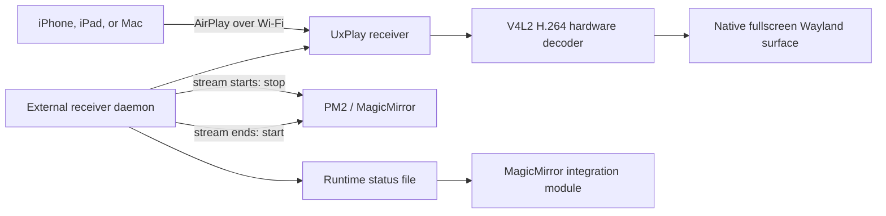

# MMM-Airplay-Receiver

Mirror an iPhone, iPad, or Mac to a MagicMirror display on Raspberry Pi using
[UxPlay](https://github.com/FDH2/UxPlay). The final design runs UxPlay as an
independent `systemd` user service, temporarily stops MagicMirror while a
client is mirroring, and renders the AirPlay video directly into a native
fullscreen Wayland surface.

The tested Art Wall profile uses 1920×1080 at 60 fps, Raspberry Pi V4L2 H.264
hardware decoding, low-latency rendering, and no mandatory PIN. It has been
verified with iPhone, iPad, and macOS screen mirroring over Wi-Fi.

## Final architecture



The external service is important. If UxPlay were a child of MagicMirror,
stopping MagicMirror to free the display would also terminate the active
AirPlay session. Keeping the receiver in a separate service allows this
lifecycle instead:

1. The receiver stays advertised while MagicMirror is running.
2. An Apple device begins mirroring.
3. The daemon detects UxPlay's streaming event and stops the `MagicMirror` PM2
   process.
4. `waylandsink` covers the complete display; no Raspberry Pi desktop or
   MagicMirror content remains visible.
5. When mirroring ends, the daemon starts MagicMirror again.
6. If UxPlay exits unexpectedly, the service restores MagicMirror and restarts
   the receiver.

The MagicMirror module remains installed so other modules can consume receiver
status notifications. Its on-screen availability tile is disabled by default.

## Tested platform

- Raspberry Pi 4 running Raspberry Pi OS Bookworm
- Native Wayland/labwc graphical session
- MagicMirror managed by PM2 as `MagicMirror`
- Node.js and PM2 installed under `/usr/local/bin`
- UxPlay 1.73.6
- Wi-Fi-only network connection
- iPhone, iPad, and Mac AirPlay clients

Other Linux, compositor, or process-manager combinations may require path and
sink changes described below.

## Requirements

- Raspberry Pi OS or another Debian-based Linux installation with a graphical
  session
- MagicMirror² and Node.js 18 or newer
- PM2 managing MagicMirror for the automatic display handoff
- UxPlay and the required GStreamer plugins
- Avahi/mDNS for AirPlay discovery
- The Pi and Apple device on the same local network
- SSH key authentication when deploying from another computer

For a Wi-Fi-only Pi, prefer a strong 5 GHz connection, keep the Pi and client
near the same access point, and avoid a congested channel. Network jitter can
still cause choppy playback even when hardware decoding is working correctly.

## Deploy to the Pi

The deployment script copies the module without reading or replacing the
MagicMirror configuration, which may contain private calendars and tokens.

From this repository on the development machine:

```bash
./scripts/deploy.sh --install-uxplay streicher@artwall1.local
```

Omit `--install-uxplay` after UxPlay has been installed once. The installer
builds the pinned, tested UxPlay 1.73.6 release, installs its Debian and
GStreamer dependencies, and enables Avahi.

Add this entry to the `modules` array in
`~/MagicMirror/config/config.js` on the Pi:

```js
{
  module: "MMM-Airplay-Receiver",
  position: "top_center",
  config: {
    receiverName: "Art Wall",
    externalService: true,
    externalStatusFile: "/run/user/1000/mmm-airplay-receiver-status.json",
    pin: false,
    showStatus: false
  }
},
```

The numeric user ID in `externalStatusFile` is `1000` on the tested Pi. Check
it with `id -u` and adjust the path if the MagicMirror user has a different ID.

Install and start the independent receiver service:

```bash
ssh streicher@artwall1.local
cd ~/MagicMirror/modules/MMM-Airplay-Receiver
./scripts/install-service.sh
pm2 restart MagicMirror
```

The provided unit expects `node` and `pm2` at `/usr/local/bin/node` and
`/usr/local/bin/pm2`. Verify those paths with `command -v node` and
`command -v pm2`; update the service file and `receiver-daemon.config.json`
before installing if they differ.

After a later deployment, restart the already-installed receiver so it loads
the new code and configuration:

```bash
ssh streicher@artwall1.local \
  systemctl --user restart mmm-airplay-receiver.service
```

## Final receiver profile

The performance and display settings live in
`receiver-daemon.config.json`, not in the MagicMirror module entry. The checked
in profile is the profile proven on Art Wall:

| Setting | Final value | Reason |
| --- | --- | --- |
| `resolution` | `1920x1080@60` | High-quality 1080p stream with a 60 Hz target |
| `fps` | `60` | Smooth video and desktop motion |
| `lowLatency` | `true` | Uses UxPlay `-vsync no` to avoid queued frames and Mac resize failures |
| `fullscreen` | `false` | Avoids UxPlay's generic `-fs`; native Wayland fullscreen is set on the sink |
| `videoSink` | `waylandsink fullscreen=true sync=false async=false …` | Covers the complete output and renders frames immediately |
| `audioSink` | low-buffer `pulsesink` | Reduces audio buffering latency |
| decoder | `v4l2h264dec …-io-mode=mmap` | Uses Pi H.264 hardware decoding with stable buffer negotiation |
| converter | `videoconvert` | Uses the reliable software color-conversion stage after hardware decode |
| `useBt709` | `true` | Applies the Pi 4 color handling required by this display path |
| `pin` | `false` | Does not require PIN pairing for normal clients |
| `manageMagicMirror` | `true` | Enables automatic PM2 stop/start handoff |

The complete configured video sink is:

```text
waylandsink fullscreen=true sync=false async=false enable-last-sample=false processing-deadline=0
```

The decoder and converter arguments are:

```text
-vd "v4l2h264dec capture-io-mode=mmap output-io-mode=mmap"
-vc videoconvert
```

Hardware decoding remains enabled. Only color conversion is performed by the
CPU. The explicit `mmap` modes avoid the V4L2 buffer-negotiation failure seen
with automatic I/O selection on the tested Pi.

### Why immediate rendering is retained

Timestamp-synchronized playback can look smooth in a stable video stream, but
it increases delay and caused macOS mirroring to fail during the desktop resize
performed while establishing a session. The final unified profile therefore
uses UxPlay `-vsync no` together with `sync=false` on both sinks. This profile
works across the tested iPhone, iPad, and Mac clients and keeps interaction
latency low.

## PIN behaviour

PIN pairing is disabled by default and is not required for the tested clients.
UxPlay can still accommodate a managed client that requests pairing for
compatibility.

To force a one-time PIN for each new client, set `pin` to `true`. To use a
fixed PIN, set a four-digit string such as `"4821"`. Only enable
`persistTrustedClients` when PIN pairing is in use.

## MagicMirror integration options

These options belong in the module's `config.js` entry:

| Option | Recommended value | Meaning |
| --- | --- | --- |
| `receiverName` | `"Art Wall"` | Name shown in the Screen Mirroring list |
| `externalService` | `true` | Monitor the independent receiver rather than launching UxPlay inside MagicMirror |
| `externalStatusFile` | `/run/user/1000/mmm-airplay-receiver-status.json` | Runtime state written by the daemon |
| `showStatus` | `false` | Keeps the AirPlay availability/status message off the mirror |
| `pin` | `false` | No mandatory PIN pairing |

The repository retains an in-process mode for simpler installations. With
`externalService: false`, the MagicMirror node helper launches UxPlay itself.
That mode does not support stopping MagicMirror during an active session and is
not the final Art Wall design.

The configuration helpers preserve timestamped backups:

```bash
node scripts/enable-module.mjs ~/MagicMirror/config/config.js "Art Wall" waylandsink

node scripts/update-module-config.mjs ~/MagicMirror/config/config.js \
  '{"externalService":true,"externalStatusFile":"/run/user/1000/mmm-airplay-receiver-status.json","showStatus":false}'
```

## Operating the receiver

Check the receiver and MagicMirror processes:

```bash
systemctl --user status mmm-airplay-receiver.service
pm2 status
```

Follow receiver logs while connecting a device:

```bash
journalctl --user -u mmm-airplay-receiver.service -f
```

Inspect the last published integration state:

```bash
cat /run/user/1000/mmm-airplay-receiver-status.json
```

Restart the receiver without rebooting the Pi:

```bash
systemctl --user restart mmm-airplay-receiver.service
```

## Notifications

The MagicMirror module broadcasts:

- `AIRPLAY_RECEIVER_STATUS` for receiver lifecycle changes
- `AIRPLAY_RECEIVER_PIN` when UxPlay requests a PIN

In in-process mode, other modules can send `AIRPLAY_RECEIVER_START`,
`AIRPLAY_RECEIVER_STOP`, or `AIRPLAY_RECEIVER_RESTART`. Those controls are
ignored in external-service mode; use `systemctl --user` to control the daemon.

## Troubleshooting

### Receiver is not visible

```bash
systemctl status avahi-daemon
```

Confirm that the Pi and client are on the same LAN and that multicast UDP 5353
is not isolated by the Wi-Fi access point.

### A client connects and immediately disconnects

Follow the service journal during the attempt. Confirm that TCP and UDP ports
7000–7002 are allowed and that UxPlay remains running:

```bash
journalctl --user -u mmm-airplay-receiver.service -f
```

### The Pi desktop remains visible around the stream

Verify all three parts of the final handoff:

- `manageMagicMirror` is `true` and the PM2 process is named `MagicMirror`.
- `fullscreen` is `false` in the daemon config, avoiding the generic UxPlay
  fullscreen mode.
- `videoSink` contains `waylandsink fullscreen=true`.

The native sink property—not UxPlay `-fs`—is what guarantees a complete
Wayland fullscreen surface in this design.

### Hardware decoding fails

Confirm the decoder is installed and inspect the receiver journal:

```bash
gst-inspect-1.0 v4l2h264dec
journalctl --user -u mmm-airplay-receiver.service -b
```

Keep the explicit `capture-io-mode=mmap output-io-mode=mmap` settings on the
tested Pi. If `v4l2h264dec` is unavailable, verify the Raspberry Pi GStreamer
packages and `/dev/video*` devices before falling back to software decoding.

### Video is choppy

First check Wi-Fi signal quality and congestion, then look for dropped-frame or
performance messages in the journal. Also verify that UxPlay is using
`v4l2h264dec`, not a software H.264 decoder. As a fallback for a weaker network,
try `1280x720@60` before reducing the frame rate.

### Mac fails while resizing its desktop

Restore the unified final profile: 1920×1080 at 60 fps, `lowLatency: true`, and
`sync=false` on the video and audio sinks. Enabling timestamp synchronization
can cause the transition frames emitted during macOS desktop resizing to be
discarded as late.

### UxPlay cannot open the display

For the tested Wayland session, verify:

```text
XDG_RUNTIME_DIR=/run/user/1000
WAYLAND_DISPLAY=wayland-0
DBUS_SESSION_BUS_ADDRESS=unix:path=/run/user/1000/bus
```

Adjust the user ID or Wayland socket name when the graphical session uses
different values.

## Development checks

Run the test suite and JavaScript syntax checks before deployment:

```bash
npm test
npm run check
```

The tests cover argument generation, Wayland environment discovery, AirPlay
lifecycle parsing, PIN handling, and the final Art Wall hardware-accelerated
fullscreen profile.
